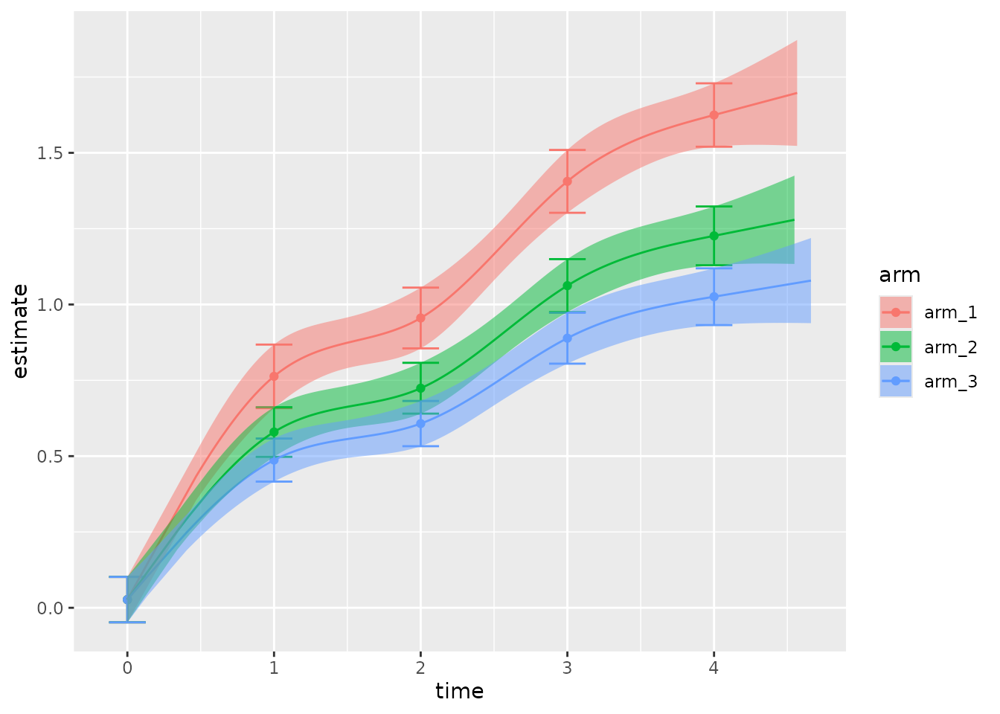

# Usage

This vignette explains how to use the `pmrm` package

## Raw data

The package functions expect tidy longitudinal data with one row per
subject visit and columns with the patient outcome, continuous time,
indicator variables, and optional covariates. The `pmrm` package has
functions to simulate datasets from each supported model.

``` r
library(pmrm)
set.seed(0)
simulation <- pmrm_simulate_decline_proportional(
  patients = 500,
  visit_times = c(0, 1, 2, 3, 4),
  tau = 0.25,
  alpha = c(0, 0.7, 1, 1.4, 1.6),
  beta = c(0, 0.2, 0.35),
  gamma = c(-1, 1)
)
```

The outcome column can have missing values, but no other column must
have missing values.[¹](#fn1)

``` r
simulation$y[c(2L, 3L, 12L, 13L, 14L, 15L)] <- NA_real_
```

The output datasets includes important information that you would supply
to a modeling function.

``` r
simulation[, c("y", "t", "patient", "visit", "arm")]
#> # A tibble: 2,500 × 5
#>         y     t patient   visit   arm  
#>     <dbl> <dbl> <chr>     <ord>   <ord>
#>  1  2.20   0    patient_1 visit_1 arm_1
#>  2 NA      1.47 patient_1 visit_2 arm_1
#>  3 NA      1.90 patient_1 visit_3 arm_1
#>  4  1.93   2.73 patient_1 visit_4 arm_1
#>  5  3.33   4.04 patient_1 visit_5 arm_1
#>  6 -4.75   0    patient_2 visit_1 arm_2
#>  7  0.271  1.16 patient_2 visit_2 arm_2
#>  8  1.95   1.97 patient_2 visit_3 arm_2
#>  9  1.99   3.09 patient_2 visit_4 arm_2
#> 10  3.60   4.45 patient_2 visit_5 arm_2
#> # ℹ 2,490 more rows
```

## Models

To fit a model, simply supply the preprocessed dataset and optionally
the knot vector `xi` (which usually just contains the scheduled times of
all the visits). The package is powered by the
[`RTMB`](https://github.com/kaskr/RTMB) package, so the model fitting
process runs fast.

``` r
system.time(
  fit <- pmrm_model_decline_proportional(
    data = simulation,
    outcome = "y",
    time = "t",
    patient = "patient",
    visit = "visit",
    arm = "arm",
    covariates = ~ w_1 + w_2,
    visit_times = c(0, 1, 2, 3, 4)
  )
)
#>    user  system elapsed 
#>   0.438   0.012   0.450
```

``` r
print(fit)
#> Model:
#> 
#>   PMRM type:        decline
#>   Parameterization: proportional
#> 
#> Fit:
#> 
#>   Convergence:    converged
#>   Observations:   2494
#>   Parameters:     24
#>   Log likelihood: -3555.535
#>   Deviance:       7111.071
#>   AIC:            7159.071
#>   BIC:            7298.79
#> 
#> Treatment effects:
#> 
#>          estimate  std.error
#>   arm_2 0.2493296 0.04117794
#>   arm_3 0.3749138 0.04023259
```

The fitted model object has parameter estimates, standard errors, model
constants, the convergence status, raw
[`RTMB`](https://github.com/kaskr/RTMB) objects, and other information.

``` r
names(fit)
#>  [1] "data"            "constants"       "options"         "objective"      
#>  [5] "model"           "optimization"    "report"          "initial"        
#>  [9] "final"           "estimates"       "standard_errors" "metrics"        
#> [13] "spline"
```

All estimates:[²](#fn2)

``` r
str(fit$estimates)
#> List of 9
#>  $ alpha : Named num [1:5] 0.0269 0.763 0.9555 1.4059 1.6247
#>   ..- attr(*, "names")= chr [1:5] "1" "2" "3" "4" ...
#>  $ theta : num [1:2] 0.249 0.375
#>  $ gamma : num [1:2] -0.954 0.995
#>  $ phi   : num [1:5] 0.0364 0.0134 -0.0022 -0.0399 0.0403
#>  $ rho   : num [1:10] -0.0429 -0.0824 0.0437 -0.0715 -0.0532 ...
#>  $ beta  : num [1:3] 0 0.249 0.375
#>  $ sigma : num [1:5] 1.037 1.014 0.998 0.961 1.041
#>  $ Lambda: num [1:5, 1:5] 1 -0.0428 -0.082 0.0436 -0.0712 ...
#>  $ Sigma : num [1:5, 1:5] 1.0756 -0.045 -0.0849 0.0434 -0.0768 ...
```

Just the estimates of actual parameters, omitting functions of other
parameters:[³](#fn3)

``` r
str(fit$final)
#> List of 5
#>  $ alpha: Named num [1:5] 0.0269 0.763 0.9555 1.4059 1.6247
#>   ..- attr(*, "names")= chr [1:5] "1" "2" "3" "4" ...
#>  $ theta: num [1:2] 0.249 0.375
#>  $ gamma: num [1:2] -0.954 0.995
#>  $ phi  : num [1:5] 0.0364 0.0134 -0.0022 -0.0399 0.0403
#>  $ rho  : num [1:10] -0.0429 -0.0824 0.0437 -0.0715 -0.0532 ...
```

## Checking and troubleshooting

Model-checking is an involved topic, and `pmrm` itself does not go into
tremendous depth. Instead, it offers only the most basic checks on the
fitted model object. The goal is to guide your intuition and high-level
understanding.

First, check the convergence code. A 0 indicates convergence, and a 1
indicates that the model diverged or a local minimum was not otherwise
reached (e.g. in the case of a saddle point).

``` r
fit$optimization$convergence
#> [1] 0
```

Next, you may wish to check that the parameter estimates and standard
errors make sense.

``` r
str(fit$estimates)
#> List of 9
#>  $ alpha : Named num [1:5] 0.0269 0.763 0.9555 1.4059 1.6247
#>   ..- attr(*, "names")= chr [1:5] "1" "2" "3" "4" ...
#>  $ theta : num [1:2] 0.249 0.375
#>  $ gamma : num [1:2] -0.954 0.995
#>  $ phi   : num [1:5] 0.0364 0.0134 -0.0022 -0.0399 0.0403
#>  $ rho   : num [1:10] -0.0429 -0.0824 0.0437 -0.0715 -0.0532 ...
#>  $ beta  : num [1:3] 0 0.249 0.375
#>  $ sigma : num [1:5] 1.037 1.014 0.998 0.961 1.041
#>  $ Lambda: num [1:5, 1:5] 1 -0.0428 -0.082 0.0436 -0.0712 ...
#>  $ Sigma : num [1:5, 1:5] 1.0756 -0.045 -0.0849 0.0434 -0.0768 ...
```

``` r
str(fit$standard_errors)
#> List of 9
#>  $ alpha : Named num [1:5] 0.0455 0.0637 0.0609 0.063 0.0636
#>   ..- attr(*, "names")= chr [1:5] "1" "2" "3" "4" ...
#>  $ theta : num [1:2] 0.0412 0.0402
#>  $ gamma : num [1:2] 0.0206 0.0205
#>  $ phi   : num [1:5] 0.0316 0.0317 0.0318 0.0318 0.0318
#>  $ rho   : num [1:10] 0.0449 0.0451 0.0449 0.0451 0.0449 ...
#>  $ beta  : num [1:3] 0 0.0412 0.0402
#>  $ sigma : num [1:5] 0.0328 0.0321 0.0318 0.0306 0.0331
#>  $ Lambda: num [1:5, 1:5] 0 0.0447 0.0446 0.0447 0.0446 ...
#>  $ Sigma : num [1:5, 1:5] 0.0681 0.0472 0.0466 0.0447 0.0486 ...
```

Also, please check for odd behavior in the fitted spline
$f\left( x|\xi,\alpha \right)$.

``` r
knots <- fit$constants$spline_knots
curve(fit$spline(x), min(knots), max(knots))
```


In tough cases, the spline may flatten out at the knot boundaries or
twist in strange directions. If you notice a strange fitted spline in a
divergent model, you may wish to experiment with different knot
placement or hand-pick initial values for the vertical knot distances
`alpha`. The latter can sometimes help stabilize `theta` (especially for
`pmrm_model_slowing()`) by beginning with an appropriately strict
monotone spline. Example:

``` r
initial <- fit$initial
initial$alpha <- c(0, 0.5, 1, 1.5, 2)

fit2 <- pmrm_model_decline_proportional(
  data = simulation,
  outcome = "y",
  time = "t",
  patient = "patient",
  visit = "visit",
  arm = "arm",
  covariates = ~ w_1 + w_2,
  visit_times = c(0, 1, 2, 3, 4),
  initial = initial # with hand-picked initial alpha
)
```

Alternatively, you can even tweak one or more parameters and then resume
the original optimization.

``` r
initial <- fit$final # true parameters from the last fit
initial$theta[2] <- 0 # reset a scalar parameter that may have diverged

fit3 <- pmrm_model_decline_proportional(
  data = simulation,
  outcome = "y",
  time = "t",
  patient = "patient",
  visit = "visit",
  arm = "arm",
  covariates = ~ w_1 + w_2,
  visit_times = c(0, 1, 2, 3, 4),
  initial = initial # with the modified parameter values
)
```

Finally, you may wish to fit a Bayesian version the model using
`tmbstan` and check for correlations among the parameters. Strong
pairwise correlations involving the $\alpha$ parameter may indicate that
your spline has too many knots.

``` r
library(dplyr)
library(tmbstan)
library(posterior)

# Fit a Bayesian version of the same model.
# Increase the number of chains for the Rhat diagnostic to be valid.
mcmc <- tmbstan(fit$model, chains = 1, refresh = 10)

# Extract the MCMC draws.
draws <- as_draws_df(mcmc) |>
  select(starts_with("alpha"), any_of(c("theta", "phi")))

# Plot pairwise correlations among MCMC draws.
# Pairs of parameters should not be strongly correlated.
# Tight correlations and funneling indicate problems,
# such as non-identifiability if you have too many knots.
pairs(draws)

# Alternatively, if you have many parameters, you can look at
# pairwise linear correlations. However, this may miss
# important pathologies.
correlations <- cor(samples)[lower.tri(cor(samples))]
hist(correlations)
```

## Summaries

Use
[`pmrm_estimates()`](https://openpharma.github.io/pmrm/reference/pmrm_estimates.md)
to compute estimates, standard errors, and confidence intervals of model
parameters and standard downstream functions of parameters. For example,
here are the active-arm post-baseline treatment effect parameters:

``` r
pmrm_estimates(fit, parameter = "theta")
#> # A tibble: 2 × 6
#>   parameter arm   estimate standard_error lower upper
#>   <chr>     <ord>    <dbl>          <dbl> <dbl> <dbl>
#> 1 theta     arm_2    0.249         0.0412 0.169 0.330
#> 2 theta     arm_3    0.375         0.0402 0.296 0.454
```

And the same for the visit-specific standard deviations of the
residuals:

``` r
pmrm_estimates(fit, parameter = "sigma", confidence = 0.9)
#> # A tibble: 5 × 6
#>   parameter visit   estimate standard_error lower upper
#>   <chr>     <ord>      <dbl>          <dbl> <dbl> <dbl>
#> 1 sigma     visit_1    1.04          0.0328 0.983  1.09
#> 2 sigma     visit_2    1.01          0.0321 0.961  1.07
#> 3 sigma     visit_3    0.998         0.0318 0.946  1.05
#> 4 sigma     visit_4    0.961         0.0306 0.911  1.01
#> 5 sigma     visit_5    1.04          0.0331 0.987  1.10
```

The [`summary()`](https://rdrr.io/r/base/summary.html) method produces
high-level metrics for model comparison.

``` r
summary(fit)
#> # A tibble: 1 × 8
#>   model   parameterization n_observations n_parameters log_likelihood deviance
#>   <chr>   <chr>                     <int>        <int>          <dbl>    <dbl>
#> 1 decline proportional               2494           24         -3556.    7111.
#> # ℹ 2 more variables: aic <dbl>, bic <dbl>
```

## Marginals

[`pmrm_marginals()`](https://openpharma.github.io/pmrm/reference/pmrm_marginals.md)
returns estimated marginal means for each study arm and visit. The
continuous time at each visit is given by the `marginals` argument to
[`pmrm_model_decline_proportional()`](https://openpharma.github.io/pmrm/reference/pmrm_model_decline_proportional.md).

``` r
pmrm_marginals(fit, type = "outcome")
#> # A tibble: 15 × 7
#>    arm   visit    time estimate standard_error   lower upper
#>    <ord> <ord>   <dbl>    <dbl>          <dbl>   <dbl> <dbl>
#>  1 arm_1 visit_1     0   0.0269         0.0455 -0.0623 0.116
#>  2 arm_1 visit_2     1   0.763          0.0637  0.638  0.888
#>  3 arm_1 visit_3     2   0.955          0.0609  0.836  1.07 
#>  4 arm_1 visit_4     3   1.41           0.0630  1.28   1.53 
#>  5 arm_1 visit_5     4   1.62           0.0636  1.50   1.75 
#>  6 arm_2 visit_1     0   0.0269         0.0455 -0.0623 0.116
#>  7 arm_2 visit_2     1   0.579          0.0497  0.482  0.677
#>  8 arm_2 visit_3     2   0.724          0.0509  0.624  0.824
#>  9 arm_2 visit_4     3   1.06           0.0531  0.958  1.17 
#> 10 arm_2 visit_5     4   1.23           0.0589  1.11   1.34 
#> 11 arm_3 visit_1     0   0.0269         0.0455 -0.0623 0.116
#> 12 arm_3 visit_2     1   0.487          0.0432  0.402  0.572
#> 13 arm_3 visit_3     2   0.607          0.0453  0.518  0.696
#> 14 arm_3 visit_4     3   0.889          0.0511  0.789  0.989
#> 15 arm_3 visit_5     4   1.03           0.0569  0.914  1.14
```

Select `type = "change"` for estimates of change from baseline.

``` r
pmrm_marginals(fit, type = "change")
#> # A tibble: 15 × 7
#>    arm   visit    time estimate standard_error  lower  upper
#>    <ord> <ord>   <dbl>    <dbl>          <dbl>  <dbl>  <dbl>
#>  1 arm_1 visit_1     0   NA            NA      NA     NA    
#>  2 arm_1 visit_2     1    0.736         0.0825  0.574  0.898
#>  3 arm_1 visit_3     2    0.929         0.0793  0.773  1.08 
#>  4 arm_1 visit_4     3    1.38          0.0757  1.23   1.53 
#>  5 arm_1 visit_5     4    1.60          0.0782  1.44   1.75 
#>  6 arm_2 visit_1     0   NA            NA      NA     NA    
#>  7 arm_2 visit_2     1    0.553         0.0684  0.419  0.687
#>  8 arm_2 visit_3     2    0.697         0.0696  0.561  0.833
#>  9 arm_2 visit_4     3    1.04          0.0697  0.899  1.17 
#> 10 arm_2 visit_5     4    1.20          0.0770  1.05   1.35 
#> 11 arm_3 visit_1     0   NA            NA      NA     NA    
#> 12 arm_3 visit_2     1    0.460         0.0612  0.340  0.580
#> 13 arm_3 visit_3     2    0.580         0.0639  0.455  0.706
#> 14 arm_3 visit_4     3    0.862         0.0685  0.728  0.996
#> 15 arm_3 visit_5     4    0.999         0.0762  0.849  1.15
```

Select `type = "effect"` for estimates of the treatment effect (change
from baseline of each active arm minus that of the control arm).

``` r
pmrm_marginals(fit, type = "effect")
#> # A tibble: 15 × 7
#>    arm   visit    time estimate standard_error  lower  upper
#>    <ord> <ord>   <dbl>    <dbl>          <dbl>  <dbl>  <dbl>
#>  1 arm_1 visit_1     0   NA            NA      NA     NA    
#>  2 arm_1 visit_2     1   NA            NA      NA     NA    
#>  3 arm_1 visit_3     2   NA            NA      NA     NA    
#>  4 arm_1 visit_4     3   NA            NA      NA     NA    
#>  5 arm_1 visit_5     4   NA            NA      NA     NA    
#>  6 arm_2 visit_1     0   NA            NA      NA     NA    
#>  7 arm_2 visit_2     1   -0.184         0.0370 -0.256 -0.111
#>  8 arm_2 visit_3     2   -0.232         0.0437 -0.317 -0.146
#>  9 arm_2 visit_4     3   -0.344         0.0641 -0.469 -0.218
#> 10 arm_2 visit_5     4   -0.398         0.0729 -0.541 -0.255
#> 11 arm_3 visit_1     0   NA            NA      NA     NA    
#> 12 arm_3 visit_2     1   -0.276         0.0413 -0.357 -0.195
#> 13 arm_3 visit_3     2   -0.348         0.0463 -0.439 -0.257
#> 14 arm_3 visit_4     3   -0.517         0.0652 -0.645 -0.389
#> 15 arm_3 visit_5     4   -0.599         0.0736 -0.743 -0.455
```

## Predictions

The package supports a
[`predict()`](https://rdrr.io/r/stats/predict.html) method for all
PMRMs. It returns the expected values, standard errors, and confidence
intervals for the outcomes given new data. All the important columns
from the original data need to be part of the new data, except that the
outcome column can be entirely absent.

``` r
predict(fit, data = head(simulation, 5))
#> # A tibble: 5 × 7
#>   arm   visit    time estimate standard_error  lower  upper
#>   <ord> <ord>   <dbl>    <dbl>          <dbl>  <dbl>  <dbl>
#> 1 arm_1 visit_1  0       0.939         0.0476  0.846  1.03 
#> 2 arm_1 visit_2  1.47    1.69          0.0521  1.59   1.80 
#> 3 arm_1 visit_3  1.90   -1.39          0.0697 -1.52  -1.25 
#> 4 arm_1 visit_4  2.73    0.622         0.0609  0.503  0.742
#> 5 arm_1 visit_5  4.04    2.92          0.0690  2.79   3.06
```

## Plots

`pmrm` supports an S3 method for the
[`plot()`](https://rdrr.io/r/graphics/plot.default.html) generic. This
method
[`plot.pmrm_fit()`](https://openpharma.github.io/pmrm/reference/plot.pmrm_fit.md)
visually compares the model to the data. The default plot shows:

- Raw estimates and confidence intervals on the data, as points and
  vertical line segments.
- Model-based marginal means and confidence intervals, as horizontal
  line segments and boxes around them.
- Model-based predictions and confidence bands, as continuous lines and
  shaded regions.

``` r
plot(
  fit,
  show_predictions = TRUE # Defaults to FALSE because predictions take extra time.
)
```


You can customize the plot: for example, to compare the fitted disease
progression trajectory across treatment arms.

``` r
plot(
  fit,
  confidence = 0.9,
  show_data = FALSE,
  show_predictions = TRUE, # Defaults to FALSE because predictions take extra time.
  facet = FALSE,
  alpha = 0.5
)
```



------------------------------------------------------------------------

1.  Baseline outcomes must not be missing.

2.  See also `fit$standard_errors`.

3.  Can be supplied to the `initial` argument of
    [`pmrm_model_decline_proportional()`](https://openpharma.github.io/pmrm/reference/pmrm_model_decline_proportional.md).
